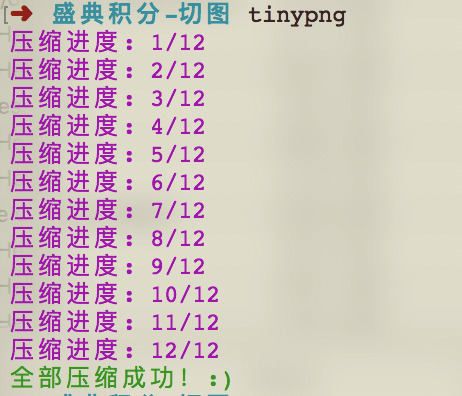
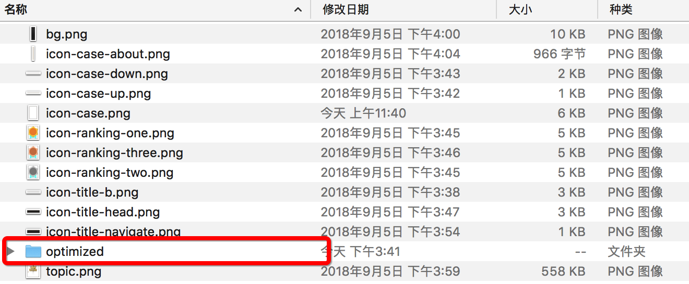

# tinypng-cli

基于[tinypng](https://tinypng.com/developers)官方提供的api做的压缩图片cli工具

## 用法

使用方式简单得 **令人发指！！**

1. 在存放图片的目录下运行`tinypng -k [官方申请的key]` 可以不填key，默认用的是我的key

2. `tinypng-cli`会在本地寻找所有`png/jpg`文件，压缩后自动生成`optimized`目录并存放其中

## 配置

可以在`config.json`里修改key和proxy配置

**可以针对公司网络做代理，这是为什么我要做个这玩意的主要原因**